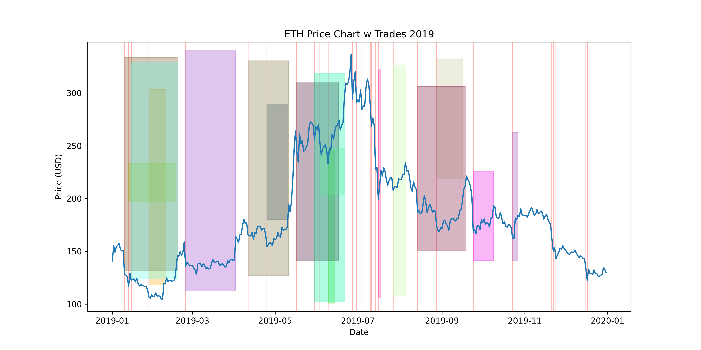

#  PROMETHEUS

>In summary, Prometheus was a prominent Titan figure in Greek mythology known for defying the gods to benefit humanity, an act for which he was severely punished, but which cemented his legacy as a champion and benefactor of humankind. 

💻 View the live decisions made by Prometheus [here](https://charts.mongodb.com/charts-prometheus-wblan/public/dashboards/445551b4-ff95-4297-be27-4ce1188f1470)


## Historical Analysis
Using Yahoo Finance, we can analyze the historical data of Bitcoin, Ethereum, and Solana to determine the number of 24-hour windows with at least a 5% price drop and the average drop window percentage. We can also determine the number of successful sell events, the average lot time, and the average profit percentage for each asset.

This data is not fully comprehensive as it only has price points once per day while Prometheus checks the price many times per day; however, this gives us a good approximation of the historical performance of this trading strategy.

Looking at `ETH` in 2019, we can see the following image

Each box represents a buy-sell combination. The colors and size of the boxes are random to be able to distinguish between them. Red lines indicate a BUY event. The width of the box represents the time from BUY to SELL. Buys only occur if the asset dropped at least 5% in the day delta. Sells only occur at the first opportunity to sell for at least a 12%
profit.

For this specific asset in 2019, we can see that the average drop window percentage is -8.52%, the average lot time is 21.29 days, and the average profit percentage is 14.67%.

You can find the images for each year in the `analysis/imgs` folder.

`BTC`
```
[ BTC ALL ]
Number of 24-hour windows with at least 5% price drop: 222
The average drop window percentage is: -7.95%
Number of successful sell events: 220
The average lot time is: 161.52 days
The average profit percentage is: 15.70%

[ BTC 2015 ]
Number of 24-hour windows with at least 5% price drop: 17
The average drop window percentage is: -9.96%
Number of successful sell events: 16
The average lot time is: 70.31 days
The average profit percentage is: 14.54%

[ BTC 2016 ]
Number of 24-hour windows with at least 5% price drop: 9
The average drop window percentage is: -8.47%
Number of successful sell events: 9
The average lot time is: 69.00 days
The average profit percentage is: 13.39%

[ BTC 2017 ]
Number of 24-hour windows with at least 5% price drop: 40
The average drop window percentage is: -7.98%
Number of successful sell events: 36
The average lot time is: 16.39 days
The average profit percentage is: 16.02%

[ BTC 2018 ]
Number of 24-hour windows with at least 5% price drop: 46
The average drop window percentage is: -7.77%
Number of successful sell events: 18
The average lot time is: 14.11 days
The average profit percentage is: 15.11%

[ BTC 2019 ]
Number of 24-hour windows with at least 5% price drop: 15
The average drop window percentage is: -8.48%
Number of successful sell events: 11
The average lot time is: 15.00 days
The average profit percentage is: 15.10%

[ BTC 2020 ]
Number of 24-hour windows with at least 5% price drop: 15
The average drop window percentage is: -8.83%
Number of successful sell events: 15
The average lot time is: 38.20 days
The average profit percentage is: 16.31%

[ BTC 2021 ]
Number of 24-hour windows with at least 5% price drop: 36
The average drop window percentage is: -7.37%
Number of successful sell events: 27
The average lot time is: 46.15 days
The average profit percentage is: 15.44%

[ BTC 2022 ]
Number of 24-hour windows with at least 5% price drop: 23
The average drop window percentage is: -8.08%
Number of successful sell events: 8
The average lot time is: 22.25 days
The average profit percentage is: 13.28%

[ BTC 2023 ]
Number of 24-hour windows with at least 5% price drop: 6
The average drop window percentage is: -5.72%
Number of successful sell events: 5
The average lot time is: 64.40 days
The average profit percentage is: 15.37%

[ BTC 2024 ] [as of 04.11.2024]
Number of 24-hour windows with at least 5% price drop: 5
The average drop window percentage is: -6.91%
Number of successful sell events: 3
The average lot time is: 14.00 days
The average profit percentage is: 12.91%
```

`ETH`
```
[ ETH ALL ]
Number of 24-hour windows with at least 5% price drop: 214
The average drop window percentage is: -8.67%
Number of successful sell events: 206
The average lot time is: 172.21 days
The average profit percentage is: 15.38%

[ ETH 2017 ]
Number of 24-hour windows with at least 5% price drop: 5
The average drop window percentage is: -9.67%
Number of successful sell events: 5
The average lot time is: 5.00 days
The average profit percentage is: 16.72%

[ ETH 2018 ]
Number of 24-hour windows with at least 5% price drop: 60
The average drop window percentage is: -8.90%
Number of successful sell events: 30
The average lot time is: 15.13 days
The average profit percentage is: 16.41%

[ ETH 2019 ]
Number of 24-hour windows with at least 5% price drop: 28
The average drop window percentage is: -8.52%
Number of successful sell events: 17
The average lot time is: 21.29 days
The average profit percentage is: 14.67%

[ ETH 2020 ]
Number of 24-hour windows with at least 5% price drop: 26
The average drop window percentage is: -9.50%
Number of successful sell events: 26
The average lot time is: 40.77 days
The average profit percentage is: 15.63%

[ ETH 2021 ]
Number of 24-hour windows with at least 5% price drop: 44
The average drop window percentage is: -8.57%
Number of successful sell events: 38
The average lot time is: 26.53 days
The average profit percentage is: 15.46%

[ ETH 2022 ]
Number of 24-hour windows with at least 5% price drop: 39
The average drop window percentage is: -8.51%
Number of successful sell events: 21
The average lot time is: 20.52 days
The average profit percentage is: 14.34%

[ ETH 2023 ]
Number of 24-hour windows with at least 5% price drop: 6
The average drop window percentage is: -6.29%
Number of successful sell events: 5
The average lot time is: 71.00 days
The average profit percentage is: 14.60%

[ ETH 2024 ] [as of 04.11.2024]
Number of 24-hour windows with at least 5% price drop: 6
The average drop window percentage is: -6.59%
Number of successful sell events: 4
The average lot time is: 10.00 days
The average profit percentage is: 14.58%
```

`SOL`
```
[ SOL ALL ]
Number of 24-hour windows with at least 5% price drop: 229
The average drop window percentage is: -9.16%
Number of successful sell events: 222
The average lot time is: 81.05 days
The average profit percentage is: 17.79%

[ SOL 2020 ]
Number of 24-hour windows with at least 5% price drop: 65
The average drop window percentage is: -9.61%
Number of successful sell events: 48
The average lot time is: 10.25 days
The average profit percentage is: 17.97%

[ SOL 2021 ]
Number of 24-hour windows with at least 5% price drop: 61
The average drop window percentage is: -9.53%
Number of successful sell events: 56
The average lot time is: 10.73 days
The average profit percentage is: 19.39%

[ SOL 2022 ]
Number of 24-hour windows with at least 5% price drop: 63
The average drop window percentage is: -9.54%
Number of successful sell events: 33
The average lot time is: 19.61 days
The average profit percentage is: 16.16%

[ SOL 2023 ]
Number of 24-hour windows with at least 5% price drop: 29
The average drop window percentage is: -7.30%
Number of successful sell events: 27
The average lot time is: 26.74 days
The average profit percentage is: 16.97%

[ SOL 2024 ] [as of 04.11.2024]
Number of 24-hour windows with at least 5% price drop: 11
The average drop window percentage is: -7.17%
Number of successful sell events: 8
The average lot time is: 17.62 days
The average profit percentage is: 13.26%
```

## Configuration

Example asset config (config.json)
```json
{
    "assets": [
        {
            "name": "Bitcoin",
            "symbol": "BTC",
            "amount_to_buy_usd": 500,
            "buy_price_percentage_change_threshold": 5.0,
            "sell_price_percentage_change_threshold": 10.0,
            "max_open_buys": 5
        },
        {
            "name": "Ethereum",
            "symbol": "ETH",
            "amount_to_buy_usd": 500,
            "buy_price_percentage_change_threshold": 5.0,
            "sell_price_percentage_change_threshold": 10.0,
            "max_open_buys": 5
        }
    ]
}
```

Example Market PREVIEW buy ($10 USD worth of BTC)
```python
cb_client.preview_market_order_buy("BTC-USD", "10")
```
response =>
```json
{
    "order_total": "10.00000000000000004545",
    "commission_total": "0.05469915464942814545",
    "errs": [],
    "warning": [],
    "quote_size": "9.9453008453505719",
    "base_size": "0.0001465019262741",
    "best_bid": "67878.27",
    "best_ask": "67885.12",
    "is_max": false,
    "order_margin_total": "0",
    "leverage": "0",
    "long_leverage": "0",
    "short_leverage": "0",
    "slippage": "0.0000000000002152"
}
```

Example Market buy response (success) ($500 USD worth of SOL)
```json
{
    "success": true,
    "failure_reason": "UNKNOWN_FAILURE_REASON",
    "order_id": "30300590-9040-4f58-a0c0-a53cf97a3adf",
    "success_response": {
        "order_id": "30300590-9040-4f58-a0c0-a53cf97a3adf",
        "product_id": "SOL-USD",
        "side": "BUY",
        "client_order_id": "b3ff6bc3-8cb7-4347-bd2a-bd6c15985604"
    },
    "order_configuration": {
        "market_market_ioc": {
            "quote_size": "500.0000"
        }
    }
}
```

Example Market PREVIEW sell (0.0001 BTC for USD)
```python
cb_client.preview_market_order_sell("BTC-USD", "0.0001")
```
response =>
```json
{
    "order_total": "6.7447079505",
    "commission_total": "0.0373010495",
    "errs": [],
    "warning": [],
    "quote_size": "6.782009",
    "base_size": "0.0001",
    "best_bid": "67820.09",
    "best_ask": "67825.33",
    "is_max": false,
    "order_margin_total": "0",
    "leverage": "0",
    "long_leverage": "0",
    "short_leverage": "0",
    "slippage": "0"
}
```

Example Market sell response (success) (0.0005 BTC for USD)
```json
{
    "success": true,
    "failure_reason": "UNKNOWN_FAILURE_REASON",
    "order_id": "595979f7-50b4-4b51-af4e-f644286bb63f",
    "success_response": {
        "order_id": "595979f7-50b4-4b51-af4e-f644286bb63f",
        "product_id": "BTC-USD",
        "side": "SELL",
        "client_order_id": "27309299-76b8-4401-9161-2692fbe22ada"
    },
    "order_configuration": {
        "market_market_ioc": {
            "base_size": "0.0005"
        }
    }
}
```
